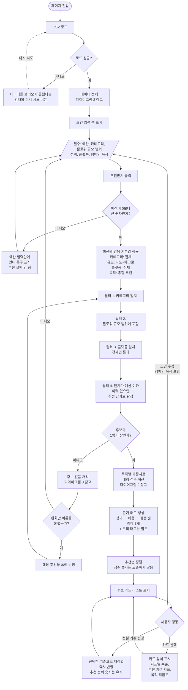
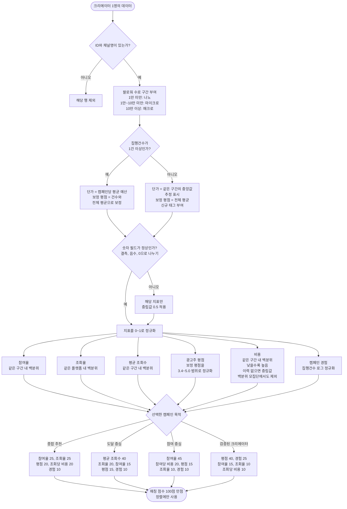

# Flowchart — 입력부터 추천 결과까지

PRD.md 3장의 추천 로직을 흐름으로 옮긴 문서다. 세 개의 다이어그램으로 나눴다.

1. 전체 흐름: 사용자 입력부터 결과 노출까지
2. 데이터 정제와 점수 산정: 크리에이터 1명이 점수를 받기까지
3. 후보 없음 처리: 후보가 0명일 때의 조건 완화와 유사 크리에이터 추천

## 1. 전체 흐름

정렬 기준 변경만 즉시 반영된다. 캠페인 목적을 포함한 모든 조건은 바꾼 뒤 [추천받기]를 눌러야 결과에 반영된다.

## 2. 데이터 정제와 점수 산정

백분위는 200명 전체를 구간(조회율은 플랫폼)별로 나눈 모집단에서 계산하고, 같은 값은 평균 순위로 처리한다. 보정 평점의 전체 평균은 로딩 시 계산한다.

## 3. 후보 없음 처리

조건을 한 번에 하나씩만 완화해 보고, 결과가 1명 이상 나오는 완화안만 버튼으로 제안한다. 버튼이 있는 완화안이 하나도 없으면 유사 크리에이터를 추천한다(PRD 3.8).

```mermaid
flowchart TD
    ZERO([필터 결과 0명]) --> R1[완화 1. 예산 조건만<br/>해제하고 다시 필터]
    R1 --> R1OK{1명 이상인가?}
    R1OK -- 예 --> S1[제안: 예산을 최저 단가까지<br/>올리면 N명<br/>대안: 예산만 초과하는 후보<br/>최대 3명, 초과 금액이 작은 순<br/>예산 초과 표시와 함께 노출]
    R1OK -- 아니오 --> R2
    S1 --> R2

    R2{플랫폼을<br/>선택했는가?}
    R2 -- 예 --> R2A[완화 2. 플랫폼만<br/>전체로 바꾸고 다시 필터]
    R2A --> R2OK{1명 이상인가?}
    R2OK -- 예 --> S2[제안: 플랫폼을<br/>전체로 넓히면 N명]
    R2OK -- 아니오 --> R3
    S2 --> R3
    R2 -- 아니오 --> R3

    R3{규모 범위를<br/>넓힐 수 있는가?<br/>나노~매크로면 불가}
    R3 -- 예 --> R3A[완화 3. 넓힐 수 있는 방향을<br/>하나씩 꺼내 아래 판단을 반복<br/>예: 마이크로만 선택 시<br/>나노 쪽, 매크로 쪽 각각]
    R3A --> R3OK{이 방향에서<br/>예산 안에<br/>1명 이상인가?}
    R3OK -- 예 --> S3[제안 버튼<br/>구간 장점 문구와 함께<br/>해당 구간까지 넓히면 N명]
    R3OK -- 아니오 --> R3B{예산을 빼면<br/>후보가 있는가?}
    R3B -- 예 --> S3B[버튼 없이 안내만<br/>해당 구간은 예산<br/>OOO원부터 가능합니다<br/>완화안 개수에 세지 않음]
    R3B -- 아니오 --> R3NEXT
    S3 --> R3NEXT
    S3B --> R3NEXT
    R3NEXT{남은 방향이<br/>있는가?}
    R3NEXT -- 예 --> R3OK
    R3NEXT -- 아니오 --> R4
    R3 -- 아니오 --> R4

    R4{카테고리를<br/>선택했는가?}
    R4 -- 예 --> R4A[완화 4. 카테고리만<br/>전체로 바꾸고 다시 필터]
    R4A --> R4OK{1명 이상인가?}
    R4OK -- 예 --> S4[제안: 카테고리 조건을<br/>해제하면 N명]
    R4OK -- 아니오 --> ANY
    S4 --> ANY
    R4 -- 아니오 --> ANY

    ANY{버튼이 있는<br/>완화안이<br/>1개 이상인가?}
    ANY -- 예 --> SHOW([원인 안내<br/>완화안 버튼, 규모 방향 안내<br/>대안 후보 표시])
    ANY -- 아니오 --> SIM[유사 크리에이터 찾기<br/>카테고리 고정<br/>규모는 위·아래 한 단계까지<br/>플랫폼 변경 가능<br/>원래 규모·플랫폼 조건에<br/>맞는 크리에이터는 제외]
    SIM --> SIMIN{예산 안에 드는<br/>유사 크리에이터가<br/>있는가?}
    SIMIN -- 예 --> SIMSORT[예산 안의 후보만 사용]
    SIMIN -- 아니오 --> SIMOVER{예산 초과<br/>유사 크리에이터가<br/>있는가?}
    SIMOVER -- 예 --> SIMSORT2[예산 초과 후보 사용<br/>초과 금액 함께 표시]
    SIMOVER -- 아니오 --> GUIDE([입력값 확인 안내<br/>현재 데이터에서는<br/>발생하지 않음])
    SIMSORT --> SIMRANK
    SIMSORT2 --> SIMRANK
    SIMRANK[덜 바뀐 순서로 최대 3명<br/>플랫폼만 다름<br/>→ 규모만 다름<br/>→ 둘 다 다름<br/>같은 그룹 안에서는 추천순]
    SIMRANK --> SIMSHOW([이런 크리에이터는 어떠세요?<br/>다른 값만 하이라이트<br/>폼 조건은 그대로])
```

## 예외 처리 요약

| 상황 | 발생 지점 | 처리 |
|---|---|---|
| CSV 로드 실패 | 페이지 진입 | 안내 문구와 다시 시도 버튼 |
| 예산이 공란, 0 이하, 숫자가 아님 | 추천받기 클릭 | 입력란에 안내 문구, 추천 실행 안 함 (쉼표는 허용) |
| 카테고리·규모·플랫폼·목적 미선택 | 추천받기 클릭 | 기본값(전체, 종합 추천) 적용 |
| 광고주 평점 공란 (27명) | 데이터 정제 | 보정 평점이 전체 평균이 됨, 신규 태그 |
| 이력 없는 크리에이터의 단가 0원 (27명) | 데이터 정제 | 같은 구간 중앙값을 추정 단가로 사용, 추정 표시 |
| 숫자 필드 결측·음수·0으로 나누기 | 데이터 정제 | 해당 지표만 중립값 0.5 |
| ID·채널명 누락 | 데이터 정제 | 해당 행 제외 |
| 후보 0명 | 필터 이후 | 조건 완화안과 대안 후보 제시 |
| 규모 확장 방향이 예산 때문에 0명 | 후보 없음 처리 | 버튼 없이 "해당 구간은 예산 OOO원부터 가능" 안내 |
| 모든 완화안에서도 0명 | 후보 없음 처리 | 유사 크리에이터 최대 3명 (예산 안 우선, 없으면 예산 초과) |
| 유사 크리에이터도 0명 | 후보 없음 처리 | 입력값 확인 안내 (현재 데이터에서는 발생하지 않음) |
