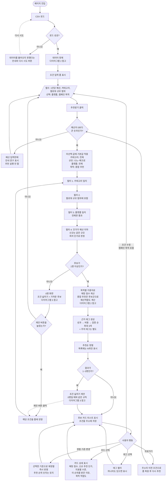
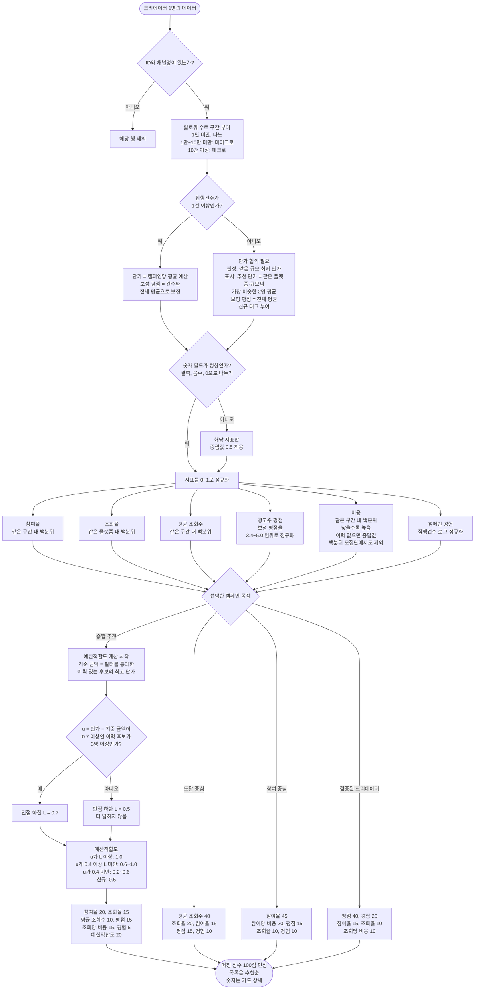
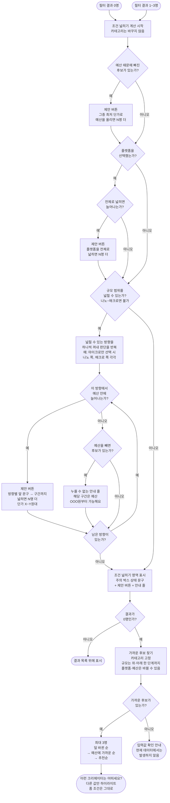

# Flowchart — 입력부터 추천 결과까지

PRD.md 3장의 추천 로직을 흐름으로 옮긴 문서다. 세 개의 다이어그램으로 나눴다. (PRD v1.0 기준)

1. 전체 흐름: 사용자 입력부터 결과 노출까지
2. 데이터 정제와 점수 산정: 크리에이터 1명이 점수를 받기까지
3. 조건 넓히기와 가까운 후보: 결과가 0명이거나 1~3명일 때

## 1. 전체 흐름

정렬 기준 변경만 즉시 반영된다. 캠페인 목적을 포함한 모든 조건은 바꾼 뒤 [추천받기]를 눌러야 결과에 반영된다.

## 2. 데이터 정제와 점수 산정

백분위는 200명 전체를 구간(조회율은 플랫폼)별로 나눈 모집단에서 계산하고, 같은 값은 평균 순위로 처리한다. 예산적합도만 추천할 때마다 현재 후보군으로 계산한다(이력 있는 후보가 0명이면 전원 0.5). 보정 평점의 전체 평균은 로딩 시 계산한다.

## 3. 조건 넓히기와 가까운 후보

결과가 0명이거나 1~3명이면 같은 규칙으로 "조건 넓히기" 제안을 계산한다(PRD 3.7). 카테고리는 바꾸지 않는다. 0명이면 가까운 후보(PRD 3.8)도 함께 보여준다.

덜 바뀐 순: 바뀐 조건 수(예산 초과·플랫폼·규모)가 적은 순이고, 수가 같으면 예산만 > 플랫폼만 > 규모만 순이다.

## 예외 처리 요약

| 상황 | 발생 지점 | 처리 |
|---|---|---|
| CSV 로드 실패 | 페이지 진입 | 안내 문구와 다시 시도 버튼 |
| 예산이 공란, 0 이하, 숫자가 아님 | 추천받기 클릭 | 입력란에 안내 문구, 추천 실행 안 함 (쉼표는 허용) |
| 카테고리·규모·플랫폼·목적 미선택 | 추천받기 클릭 | 기본값(전체, 종합 추천) 적용 |
| 광고주 평점 공란 (27명) | 데이터 정제 | 보정 평점이 전체 평균이 됨, 신규 태그 |
| 이력 없는 크리에이터의 단가 0원 (27명) | 데이터 정제 | 단가 협의 필요로 표시, 비슷한 크리에이터 2명 기준 추천 단가를 보여주고 예산은 같은 규모 최저 단가로 판정 |
| 숫자 필드 결측·음수·0으로 나누기 | 데이터 정제 | 해당 지표만 중립값 0.5 |
| ID·채널명 누락 | 데이터 정제 | 해당 행 제외 |
| 종합 추천에서 이력 있는 후보가 0명 | 점수 산정 | 예산적합도 전원 0.5 |
| 후보 0명 | 필터 이후 | 조건 넓히기 제안 + 가까운 후보 |
| 후보 1~3명 | 필터 이후 | 결과와 함께 조건 넓히기 제안 |
| 규모 확장 방향이 예산 때문에 0명 | 조건 넓히기 | 누를 수 없는 안내 줄 "해당 구간은 예산 OOO원부터 가능해요" |
| 가까운 후보도 0명 | 0명 화면 | 입력값 확인 안내 (현재 데이터에서는 발생하지 않음) |
